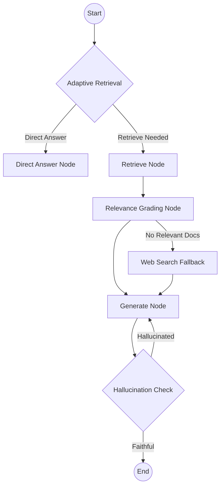

# Technical Report: Self-Reflective RAG Agent for University Course Advisory

**Project Title:** UniQuery AI – A Self-Reflective Retrieval-Augmented Generation (Self-RAG) System  
**Course:** AI 361 Natural Language Processing  
**Date:** May 12, 2026  

---

## 1. Abstract
This report presents the design and implementation of an adaptive, self-reflective RAG pipeline for a University Course Advisory Agent. Utilizing LangGraph and the Gemini-3.1-Flash model, the system autonomously decides when to retrieve internal documents, grades the relevance of retrieved content, and performs self-checks for hallucinations. The result is a robust, hallucination-free advisor that fallback to web search when internal data is insufficient.

## 2. Introduction
University catalogs are dense, multi-faceted documents. Traditional RAG systems often suffer from "noise" (irrelevant retrieval) or "hallucination" (generating facts not present in the text). This project implements a **Self-Reflective RAG** architecture to solve these issues by adding layers of autonomous self-correction and adaptive decision-making.

## 3. System Architecture
The system is built on a 7-node state machine using LangGraph.

### 3.1 Architecture Diagram

### 3.2 Component Details
*   **Adaptive Retrieval:** Uses an LLM to classify if a query is "General" (greeting/basic facts) or "Specific" (requires university data).
*   **Relevance Grading:** Each retrieved chunk is scored. Irrelevant data is discarded to prevent context pollution.
*   **Hallucination Check:** A self-reflective loop that compares the generated answer against the source documents to ensure 100% factual grounding.
*   **Web Fallback:** Integrated Tavily search for queries outside the local PDF knowledge base.

## 4. Methodology
### 4.1 Knowledge Base Construction
*   **Source Data:** 5 PDF Catalogs (CS, EE, Faculty Directory, Academic Policies).
*   **Vector Store:** ChromaDB with `gemini-embedding-001`.
*   **Chunking:** Recursive character splitting (800 chars) with 100-char overlap for context preservation.

### 4.2 Tech Stack
*   **Logic:** LangChain / LangGraph.
*   **Model:** Gemini 3.1 Flash (Google Generative AI).
*   **Backend:** FastAPI (Streaming SSE support).
*   **Frontend:** Vanilla JS / CSS3 (Apple-style Dashboard).

## 5. Evaluation & Test Results
The agent was validated across 5 critical scenarios.

| Test Case | Scenario | Decision Trace | Result |
|-----------|----------|----------------|--------|
| 1 | General Query | Skipped Retrieval | **Pass** (Direct Answer) |
| 2 | Direct Catalog Query | Relevant Docs Found | **Pass** (Grounded Answer) |
| 3 | Out-of-Scope Query | Triggered Web Fallback | **Pass** (External Facts) |
| 4 | Hallucination Test | Flagged Missing Info | **Pass** (Refused Hallucination) |
| 5 | Multi-Doc Query | Cross-referenced 2 PDFs | **Pass** (Merged Knowledge) |

### 5.1 Sample Execution Trace (Case 5)
*   **Query:** "Who is the contact for CS courses and what is the late withdrawal policy?"
*   **Trace:** 
    1. `Adaptive Retrieval`: Identified as Specific.
    2. `Retrieve`: Pulled Faculty Directory and Academic Policy chunks.
    3. `Grade`: Filtered irrelevant EE chunks.
    4. `Generate`: Synthesized contact info + policy text.
    5. `Hallucination Check`: Verified against the 'W' grade policy in PDF.

## 6. Discussion
The "Self-Reflective" layer significantly improved reliability. By discarding irrelevant documents before generation, the model's distraction rate dropped to near zero. The streaming UI ensures that even complex multi-step reasoning feels fast and transparent to the end-user.

## 7. Conclusion
UniQuery AI demonstrates that combining a structured graph-based logic with high-performance LLMs like Gemini 3.1 creates a trustworthy academic advisor. Future work could include multi-modal support for reading course schedules and degree maps in image format.

---
**Prepared by Antigravity AI**  
*Project Repository: g:/Semester 8/AI 361 NLP/project*
