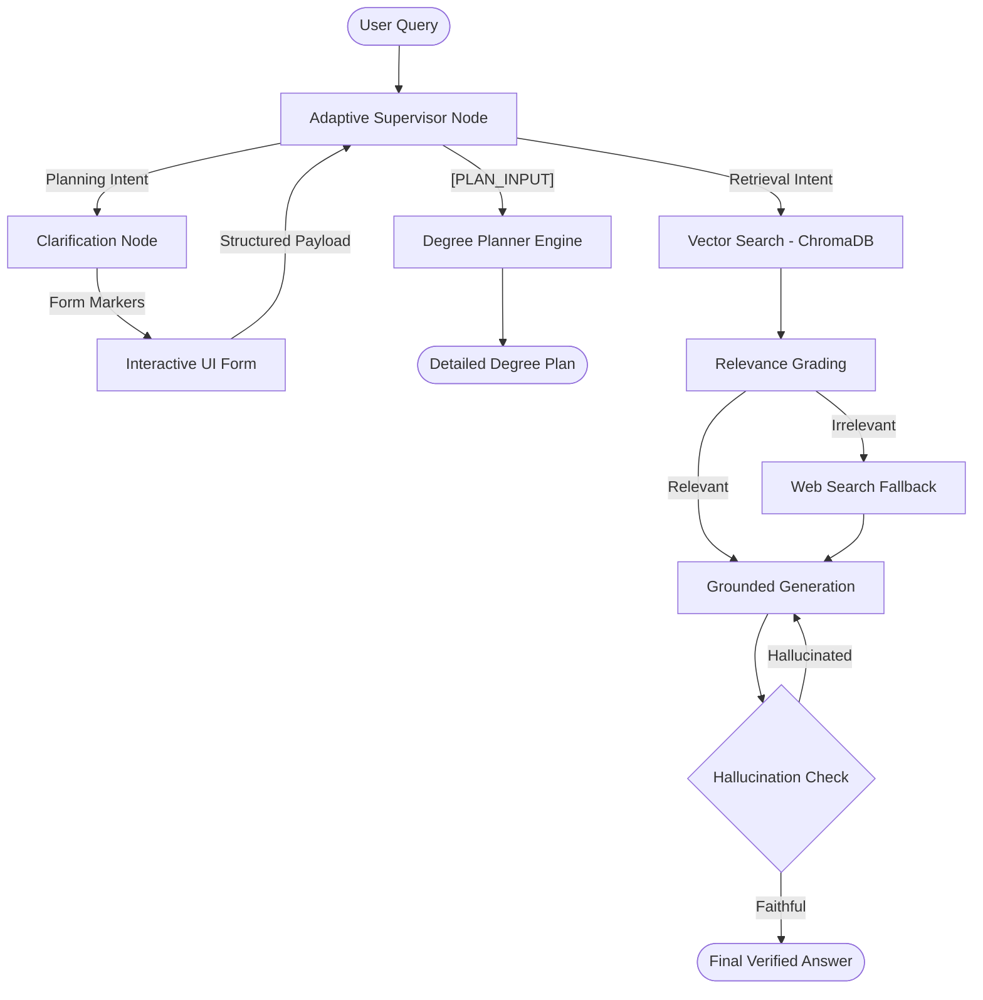

# UniQuery AI — Agentic University Advisor & Degree Planner

UniQuery AI is a production-grade, agentic university advisory system designed for students of the Ghulam Ishaq Khan Institute (GIKI). It combines an **Agentic Degree Planner** with a **Self-Reflective RAG Advisor** to provide mathematically correct academic roadmaps and verified institutional knowledge.

---


## 🚀 Key Features

### 1. Agentic Degree Planner (Core Focus)
The planner uses a **greedy constraint-based scheduler** to build a personalized roadmap from a student's current position to graduation.
- **Policy Enforcement:** Automatically applies a 12-credit cap for students on Academic Probation (CGPA < 2.0).
- **Prerequisite Awareness:** Mathematically ensures all prerequisite chains from the **UG-Prospectus-2022** are satisfied.
- **Failure Recovery:** Prioritizes failed course retakes and automatically defers dependent future courses.
- **Fuzzy Course Resolver:** Detects courses from natural language (e.g., "deep neural networks" → AI341).
- **Summer Optimization:** Intelligent placement of retake courses in summer sessions to accelerate graduation.

### 2. Self-Reflective RAG Advisor
An advanced retrieval pipeline that answers complex questions about university life.
- **Multi-Doc Context:** Synthesizes information from catalogs, faculty directories, and academic policy PDFs.
- **Hallucination Prevention:** A self-reflection node verifies the generated answer against source documents.
- **Relevance Grading:** Automatically discards irrelevant retrieval results to ensure precision.
- **Web Fallback:** Integrated Tavily search for queries outside the local prospectus.

---

## 🏗️ System Architecture

The system is built as a state-aware agent using **LangGraph**, enabling complex decision-making and self-correction loops.



---

## 📚 Data Source: UG-Prospectus-2022
The system is powered by the **Real GIK Institute Undergraduate Prospectus 2022**. 
- **Deterministic Data:** Course codes, credit hours, and prerequisites were extracted directly from pages 51–60 of the prospectus.
- **Degrees Supported:** BSAI (AI Powered by Huawei), BSCS, BSDS, BSSE, and BSCE.
- **Knowledge Base:** Over 240 pages of university catalog and faculty data indexed in a ChromaDB vector store.

---

## 🛠️ Tech Stack
- **Orchestration:** LangGraph (State Machine)
- **LLM:** Gemini 3.1 Flash Lite (Reasoning & Generation)
- **Embeddings:** Gemini Embedding 001
- **Database:** ChromaDB (Vector Store)
- **Framework:** FastAPI (Streaming SSE Backend)
- **UI:** Vanilla JavaScript / CSS3 (Apple-style Dashboard)

---

## 📂 Project Structure
- `app.py`: FastAPI server and streaming logic.
- `graph.py`: LangGraph node definitions and edge routing.
- `planner_logic.py`: The core constraint engine for degree scheduling.
- `ingest.py`: PDF processing and vector store construction.
- `data/`: Real GIKI PDF documents and structured JSON curricula.
- `static/`: Modern, interactive frontend files.

---

## 🚦 Getting Started

1. **Setup Environment:**
   ```bash
   python -m venv venv
   source venv/Scripts/activate
   pip install -r requirements.txt
   ```

2. **Ingest Data:**
   ```bash
   python ingest.py
   ```

3. **Run Application:**
   ```bash
   python app.py
   ```

---
**Kashif Mehmood** · Registration No: 2022248  
AI 361 — Natural Language Processing, GIK Institute
